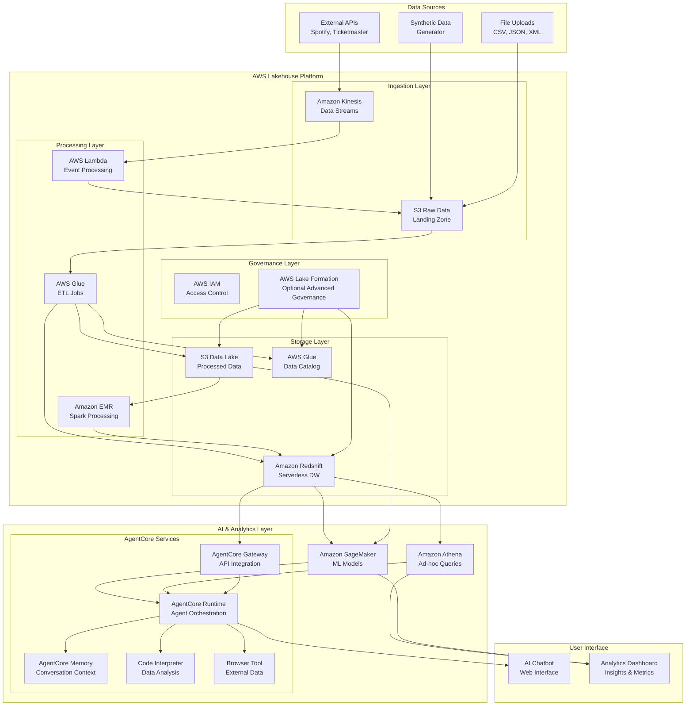

# Design Document: Data Readiness for AI Tech Demo

## Overview

The Data Readiness for AI tech demo showcases a comprehensive data platform built on AWS technologies, demonstrating the complete journey from raw data ingestion to AI-powered insights. The system uses a rock concert domain (artists, venues, concerts, ticketing) to illustrate real-world data challenges and solutions.

The platform demonstrates modern data architecture patterns including:
- **Lakehouse Architecture**: Unified data lake and warehouse capabilities
- **Event-Driven Processing**: Real-time and batch data processing
- **AI-First Design**: Native integration with machine learning and conversational AI
- **Governance-by-Design**: Built-in data quality, security, and compliance

## Architecture

### High-Level Architecture



### Data Flow Architecture

1. **Ingestion**: Multiple data sources feed into Kinesis streams and S3 landing zones
2. **Processing**: AWS Glue and EMR transform raw data into structured formats
3. **Storage**: Processed data stored in S3 data lake and Redshift data warehouse
4. **Governance**: IAM manages access control, with optional Lake Formation for advanced governance
5. **AI/ML**: SageMaker trains models on processed data
6. **AgentCore**: Provides intelligent agent capabilities with memory and code execution
7. **Interface**: Web-based chatbot and analytics dashboard for user interaction

## Components and Interfaces

### 1. Data Ingestion Service

**Purpose**: Collect concert data from multiple sources and formats

**Components**:
- **API Connector**: Interfaces with Spotify, Ticketmaster, MusicBrainz APIs
- **File Processor**: Handles CSV, JSON, XML uploads
- **Stream Handler**: Manages real-time data via Kinesis
- **Data Validator**: Ensures incoming data meets quality standards

**Interfaces**:
```python
class DataIngestionService:
    def ingest_api_data(source: str, endpoint: str) -> IngestionResult
    def process_file_upload(file_path: str, format: str) -> IngestionResult
    def validate_data_quality(data: Dict) -> ValidationResult
    def emit_to_stream(data: Dict, stream_name: str) -> StreamResult
```

### 2. Data Processing Pipeline

**Purpose**: Transform raw data into normalized, analysis-ready formats

**Components**:
- **ETL Orchestrator**: Manages Glue job execution and dependencies
- **Data Normalizer**: Standardizes artist names, venue information, date formats
- **Deduplication Engine**: Identifies and resolves duplicate records
- **Quality Monitor**: Tracks data quality metrics and anomalies

**Interfaces**:
```python
class DataProcessingPipeline:
    def execute_etl_job(job_name: str, parameters: Dict) -> JobResult
    def normalize_artist_data(raw_artists: List[Dict]) -> List[NormalizedArtist]
    def deduplicate_records(dataset: str, match_criteria: List[str]) -> DeduplicationResult
    def monitor_data_quality(table_name: str) -> QualityReport
```

### 3. AI Insights Engine

**Purpose**: Generate intelligent recommendations and predictions using processed data

**Components**:
- **Model Training Service**: Trains SageMaker models on concert data
- **Prediction Engine**: Generates venue popularity and ticket sales predictions
- **Recommendation System**: Provides personalized concert recommendations
- **Insight Generator**: Creates analytical insights and trends

**Interfaces**:
```python
class AIInsightsEngine:
    def train_prediction_model(model_type: str, training_data: str) -> ModelResult
    def predict_ticket_sales(artist_id: str, venue_id: str, date: str) -> PredictionResult
    def generate_recommendations(user_preferences: Dict) -> List[Recommendation]
    def analyze_trends(time_period: str, metrics: List[str]) -> TrendAnalysis
```

### 4. Concert AI Chatbot

**Purpose**: Provide conversational interface to concert data and insights

**Components**:
- **AgentCore Runtime**: Orchestrates agent execution and tool usage
- **Memory Service**: Maintains conversation context and user preferences
- **Code Interpreter**: Executes data analysis code dynamically
- **Browser Tool**: Fetches real-time concert information
- **Query Processor**: Translates natural language to data queries

**Interfaces**:
```python
class ConcertAIChatbot:
    def process_user_query(query: str, session_id: str) -> ChatResponse
    def execute_data_analysis(code: str, context: Dict) -> AnalysisResult
    def fetch_external_data(url: str, data_type: str) -> ExternalDataResult
    def generate_visualization(data: Dict, chart_type: str) -> VisualizationResult
    def maintain_conversation_memory(session_id: str, interaction: Dict) -> MemoryResult
```

### 5. Data Governance Service (Optional)

**Purpose**: Manage advanced data access, quality, and compliance using Lake Formation

**Note**: This component is optional and can be implemented to showcase advanced governance capabilities. The core demo functions with IAM-based access control.

**Components**:
- **Access Controller**: Manages fine-grained permissions via Lake Formation
- **Lineage Tracker**: Maintains data lineage and impact analysis
- **Audit Logger**: Records all data access and modifications
- **Compliance Monitor**: Ensures regulatory compliance

**Interfaces**:
```python
class DataGovernanceService:
    def grant_table_access(user: str, table: str, permissions: List[str]) -> AccessResult
    def track_data_lineage(source: str, target: str, transformation: str) -> LineageResult
    def audit_data_access(user: str, resource: str, action: str) -> AuditResult
    def check_compliance(dataset: str, regulations: List[str]) -> ComplianceResult
```

## Data Models

### Core Entities

```python
@dataclass
class Artist:
    artist_id: str
    name: str
    genre: List[str]
    popularity_score: float
    formation_date: Optional[date]
    members: List[str]
    spotify_id: Optional[str]
    created_at: datetime
    updated_at: datetime

@dataclass
class Venue:
    venue_id: str
    name: str
    location: Location
    capacity: int
    venue_type: str  # arena, theater, club, outdoor
    amenities: List[str]
    ticketmaster_id: Optional[str]
    created_at: datetime
    updated_at: datetime

@dataclass
class Concert:
    concert_id: str
    artist_id: str
    venue_id: str
    event_date: datetime
    ticket_prices: Dict[str, float]  # tier -> price
    total_attendance: Optional[int]
    revenue: Optional[float]
    status: str  # scheduled, completed, cancelled
    created_at: datetime
    updated_at: datetime

@dataclass
class TicketSale:
    sale_id: str
    concert_id: str
    price_tier: str
    quantity: int
    unit_price: float
    purchase_timestamp: datetime
    customer_segment: str
    created_at: datetime
```

### Analytics Models

```python
@dataclass
class VenuePopularity:
    venue_id: str
    popularity_rank: int
    avg_attendance_rate: float
    revenue_per_event: float
    booking_frequency: float
    calculated_at: datetime

@dataclass
class ArtistPerformance:
    artist_id: str
    total_concerts: int
    avg_ticket_sales: float
    revenue_generated: float
    fan_engagement_score: float
    growth_trend: str
    calculated_at: datetime

@dataclass
class PredictionResult:
    prediction_id: str
    model_type: str
    input_features: Dict
    predicted_value: float
    confidence_score: float
    prediction_date: datetime
    actual_value: Optional[float]
```

## Error Handling

### Error Categories and Strategies

1. **Data Ingestion Errors**
   - **API Rate Limits**: Implement exponential backoff and retry logic
   - **Malformed Data**: Quarantine bad records and alert data engineers
   - **Network Failures**: Retry with circuit breaker pattern

2. **Processing Errors**
   - **ETL Job Failures**: Automatic retry up to 3 times, then manual intervention
   - **Data Quality Issues**: Flag records, continue processing, generate quality reports
   - **Resource Constraints**: Auto-scale EMR clusters, queue jobs if needed

3. **AI/ML Errors**
   - **Model Training Failures**: Rollback to previous model version
   - **Low Prediction Confidence**: Flag predictions below 70% confidence threshold
   - **Feature Drift**: Trigger model retraining when detected

4. **AgentCore Errors**
   - **Code Execution Failures**: Sandbox errors, provide fallback responses
   - **Memory Service Issues**: Graceful degradation without conversation context
   - **External API Failures**: Use cached data when available

### Error Response Format

```python
@dataclass
class ErrorResponse:
    error_code: str
    error_message: str
    error_category: str
    timestamp: datetime
    correlation_id: str
    retry_after: Optional[int]
    suggested_action: str
```

## Testing Strategy

### Unit Testing
- **Data Processing Functions**: Test normalization, validation, and transformation logic
- **AI Model Components**: Test feature engineering and prediction functions
- **AgentCore Integrations**: Mock external services and test agent responses
- **API Endpoints**: Test all REST API endpoints with various input scenarios

### Integration Testing
- **End-to-End Data Flow**: Test complete pipeline from ingestion to insights
- **AWS Service Integration**: Test Glue, Redshift, and SageMaker interactions (Lake Formation if implemented)
- **AgentCore Service Integration**: Test Memory, Code Interpreter, and Browser tool interactions
- **External API Integration**: Test with actual API responses and error conditions

### Performance Testing
- **Data Processing Throughput**: Test ETL jobs with large datasets
- **Query Performance**: Test Redshift and Athena query response times
- **Chatbot Response Time**: Test AgentCore response times under load
- **Concurrent User Load**: Test system behavior with multiple simultaneous users

### Demo Validation Testing
- **User Journey Testing**: Test complete demo scenarios from data ingestion to AI insights
- **Chatbot Conversation Testing**: Test natural language understanding and response quality
- **Visualization Testing**: Ensure charts and graphs render correctly across browsers
- **Data Accuracy Testing**: Validate that insights match expected analytical results

### Test Data Strategy
- **Synthetic Data Generation**: Create realistic concert data for testing
- **API Mocking**: Mock external API responses for consistent testing
- **Data Scenarios**: Test with various data quality issues and edge cases
- **Performance Datasets**: Generate large datasets for performance testing